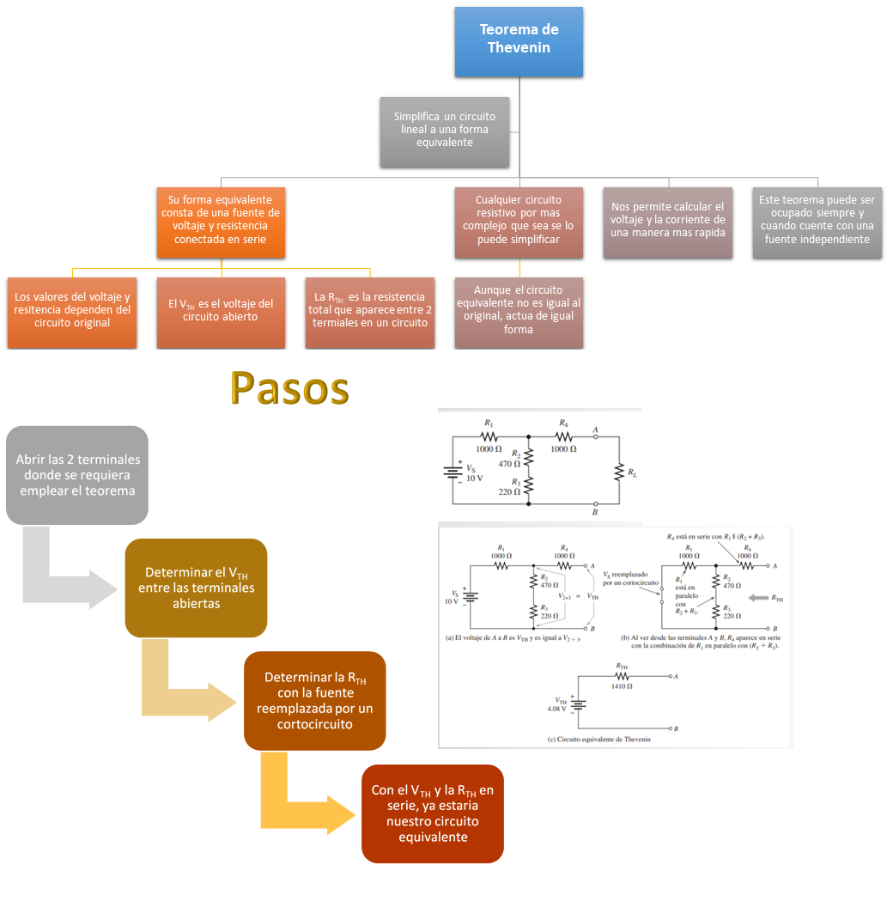
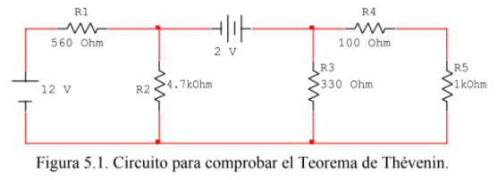
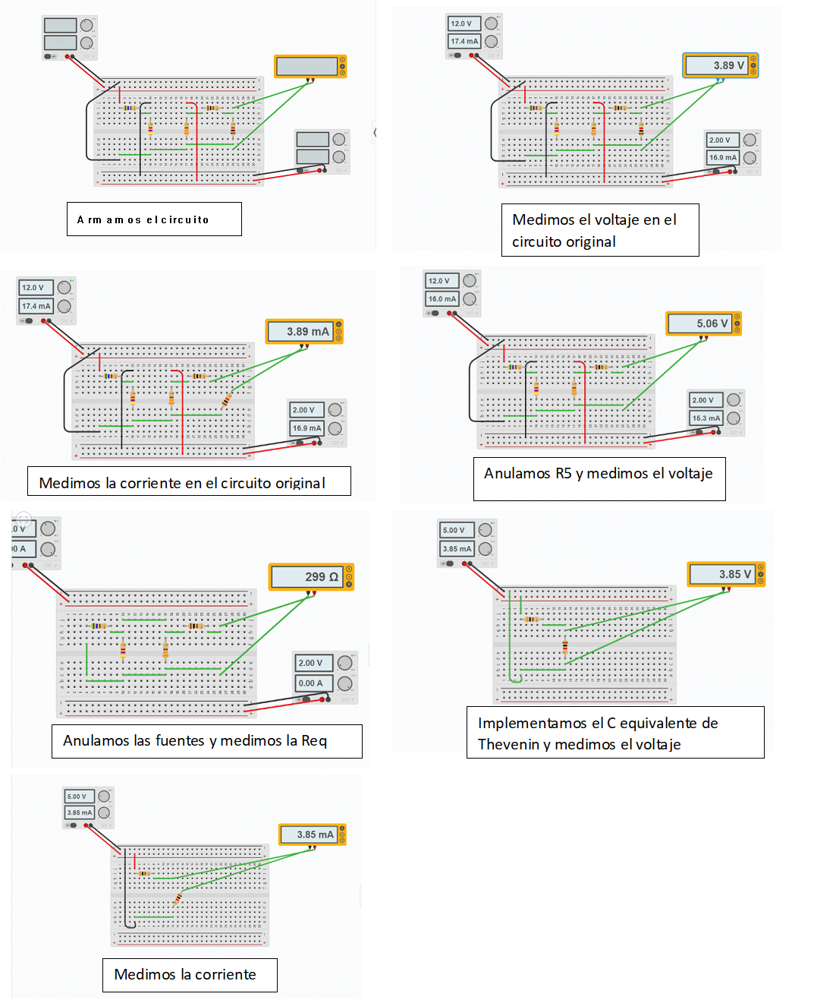
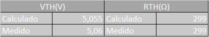
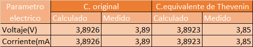

# PRACTICA-No.-5-TEOREMA-DE-THEVENIN
# Informe 

1. OBJETIVOS 

1.1. OBJETIVO GENERAL

- Emplear el teorema de Thevenin en el circuito y asi encontrar una fuente y resistencia equivalente mas conocidas como fuente y resistencia de Thevenin.

 1.2. OBJETIVO ESPECIFICO

- Simular un circuito resistivo de forma virtual en la plataforma de TINKERCAD.

- Demostrar que un circuito complejo puede reducirse a uno mas simple donde cuente con solo una fuente de voltage y una resistencia.

- Comparar los calculos teoricos con los resultados practicos y asi poder determinar si existe algun margen de error.
2. MARCO TEORICO

3. DIAGRAMAS

Ahora haremos la simulacion del circuito en TINKERCAD

4. LISTA DE COMPONENTES

| CANTIDAD|MATERIAL O EQUIPO|
| ----- | ---- |
|2|Fuente de Voltaje de C.D.|
|2|Multimetros digitales|
|1|Resistor de 560 Ω|
|1|Resistores de 4.7 kΩ|
|1|Resistor de 330 Ω|
|1|Resistor de 100 Ω|
|1|Resistor de 1 kΩ|
|1|Potenciometro de precision de 1 kΩ|
|1|Protoboard|

Tambien se utilizo tinkercad que nos sirvio como laboratorio virtual.

5. EXPLICACION 

- Abrimos el simulador de TINKERCAD y seleccionamos nuevo circuito
- Elegimos los materiales ya antes mencionados 
- Conectamos los componentes siguiendo el esquema de la figura 5.1
- Medimos el V y I en la resistencia R_5
- Anotamos los resultados en la tabla 5.2
- Retiramos R_5 y tomamos el V en el circuito abierto
- Anotamos los resultados en la tabla 5.1
- Reemplazamos la fuente de V por un cortocircuito y medimos la resistencia equivalente
- Anotamos los resultados en la tabla 5.1
- Ya con el circuito equivalente regrsamos R_5 a su sitio y medimos su V y I
- Anotamos los resultados en la tabla 5.2

Tabla 5.1. Valores del Circuito Equivalente de Thevenin

Tabla 5.2. Comprobacion del Teorrema de Thevenin

6. CONCLUCION 

- Al comparar los calculos practicos y los resultados obtenidos anotados en las tablas 5.1 y 5.2 podemos notar una pequeña variacion y esos nos produce un minimo margen de error 

7. BIBLIOGRAFIA
- X. (2020, 20 julio). de Thevenin explicado para que lo Entiendas. Teorema. https://www.teorema.top/teorema-de-thevenin/

- Sadiku. (sf). Teoremas de circuitos. En Sadiku, Fundamentos de Circuitos Eléctricos

- Floyd, T. (2007). PRINCIPIOS DE CIRCUITOS ELÉCTRICOS. (8va ed.). México, México: Pearson Education.

